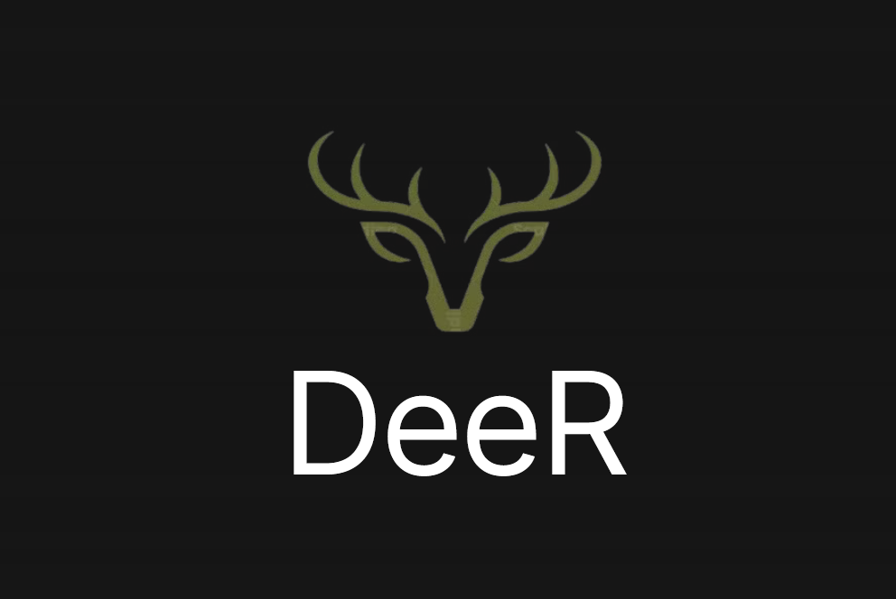
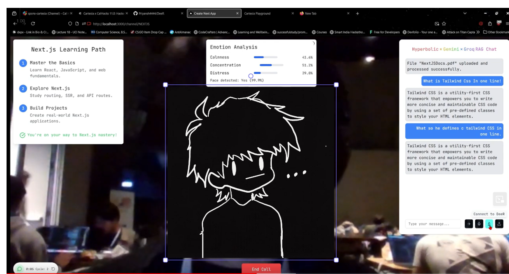
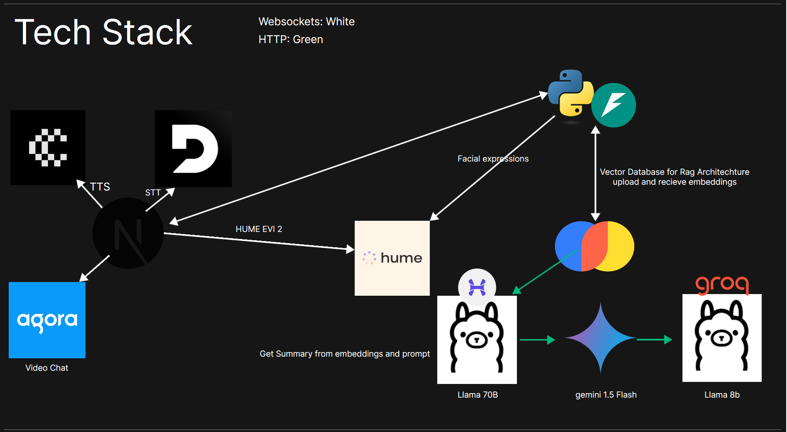

# DeeR (Deep Retention) 🦌



[]
[]
[]

[Watch Demo Video](https://youtu.be/1LN9q6boel8) | [DevPost](https://devpost.com/software/deer)


## About DeeR

DeeR is an emotionally intelligent AI study companion that helps students learn and retain information. Born from the intersection of neuroscience, computer science, and educational psychology, DeeR implements the renowned Richard Feynman technique while actively monitoring and responding to students' emotional states during their learning journey.

## The Challenge Being Addressed

In today's fast-paced academic environment, an alarming 70% of students develop mental health issues due to academic pressure. The rapid scaling of course difficulty often leaves students struggling to keep pace, leading many to abandon their passions or drop out entirely. Traditional solutions often focus on external study techniques, overlooking a crucial internal factor: emotions. Research shows that we are constantly emotional beings, with blood flowing through our brain's emotional circuitry at all times, significantly impacting our ability to learn and retain information.


## Our Solution

DeeR takes a revolutionary approach by combining emotional intelligence with proven learning techniques. Studies have demonstrated that positive emotional states like concentration and calmness can increase retention by up to 50% during study sessions. Conversely, distress can decrease learning efficiency by 30% and trigger negative feedback loops that erode self-confidence and academic performance.

Our platform actively monitors emotional states through advanced AI, detecting subtle changes in concentration, calmness, and distress levels. When the system identifies optimal learning conditions, it encourages continued engagement. If signs of distress appear, DeeR provides timely interventions to prevent negative spirals and maintain effective learning patterns.



## Key Features

DeeR seamlessly integrates multiple technologies to create a comprehensive learning environment. The platform performs real-time emotion detection using sophisticated AI models (DeepGram to record stutters and Hume for getting Emotions through voice!), while implementing the Feynman technique to enhance understanding and retention. Users can create customized study cycles and workflows, while the system automatically generates concise summaries from various document formats.

When users show signs of distress, DeeR intelligently suggests breaks and adjustments to maintain optimal learning conditions.



## Getting Started

To run DeeR locally, follow these simple steps:

```bash
# Clone the repository
git clone https://github.com/yourusername/deer.git
cd deer

# Install dependencies
pip install -r requirements.txt
npm install

# Run the application
python server.py    # Backend
npm run dev        # Frontend
```

## The Team

DeeR was developed as a solo project by me🦌, a Computer Science student at UCI, during Cal Hacks 11.0. This project represents a fusion of personal experience with academic challenges and a desire to create meaningful solutions for students worldwide.

## Acknowledgments

This project wouldn't have been possible without the support of Cal Hacks 11.0, our API providers, and the broader neuroscience research community. Their contributions have been instrumental in creating a tool that we believe will make a real difference in students' academic journeys.

---

### Made with ❤️ at Cal Hacks 11.0
